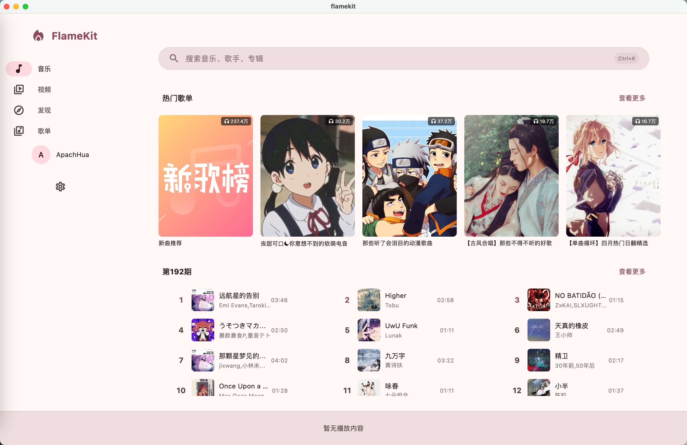
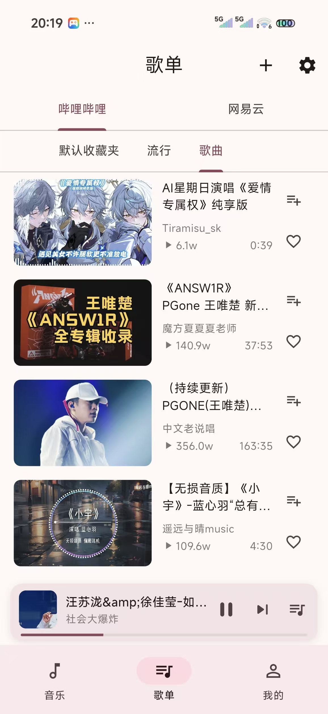

# FlameKit

[](https://flutter.dev)
[](https://github.com/user/flamekit)
[](LICENSE)

FlameKit 是一款基于 Flutter 开发的多源音乐播放器，支持 Bilibili 和网易云音乐两个音乐源，提供跨平台的音视频播放体验。

## Screenshots

### Desktop

<div align="center">
  
</div>

### Mobile

<table>
  <tr>
    <td align="center" width="33%">
      
      <br>
      <sub><b>播放界面</b></sub>
    </td>
    <td align="center" width="33%">
      
      <br>
      <sub><b>搜索界面</b></sub>
    </td>
    <td align="center" width="33%">
      
      <br>
      <sub><b>播放列表</b></sub>
    </td>
  </tr>
</table>

## Features

### Core Playback

- Bilibili 音频 / 视频播放（多清晰度切换）
- 网易云音乐搜索与播放（原生 WEAPI / EAPI 加密，无需外部 API 服务）
- 播放队列管理（添加、删除、拖拽排序）
- 播放模式切换（顺序 / 随机 / 单曲循环）
- 音视频模式切换、Mini 播放器与全屏播放器

### Search

- Bilibili 视频搜索（热搜、搜索建议、分页加载）
- 网易云音乐歌曲搜索（分页加载）
- 搜索源切换（B站 / 网易云）与搜索历史记录

### Lyrics

- LRCLIB 在线歌词匹配
- Bilibili 字幕歌词回退
- 网易云原生 LRC 歌词
- 逐行歌词滚动显示

### Discovery

- Bilibili 热门音乐榜单 & 热门音乐 MV
- 网易云新歌速递 & 推荐歌单

### Collection & Playlist

- Bilibili 收藏夹管理（查看、添加、创建文件夹）
- Bilibili 播放列表浏览与批量播放

### Smart Source Switching

- 网易云歌曲无法获取音频链接时，自动从 B 站搜索同名歌曲并播放
- 换源过程用户无感，自动完成

### Others

- Material You 动态主题配色
- Bilibili 扫码登录
- 视频模式（media_kit + mpv）
- 音频质量选择

## Roadmap

- [ ] 网易云音乐账号登录（当前为游客模式）
- [ ] 网易云歌单详情页
- [ ] 下载 / 离线缓存
- [ ] 桌面歌词 / 状态栏歌词
- [ ] iOS 支持
- [ ] 均衡器 / 音效设置
- [ ] 定时关闭
- [ ] 歌曲评论查看
- [ ] 跨设备同步播放列表
- [ ] 更多音乐源接入（QQ 音乐、酷狗等）

## Getting Started

### Prerequisites

- Flutter 3.x
- Android SDK / Linux 桌面环境 / macOS / Windows

### Build

```bash
# 安装依赖
flutter pub get

# Debug 运行
flutter run

# Release 构建
flutter build apk --release
```

### Signing Configuration

在 `android/` 目录下创建 `key.properties` 文件：

```properties
storePassword=your_password
keyPassword=your_password
keyAlias=upload
storeFile=upload-keystore.jks
```

## Contributing

欢迎提交 Pull Request！无论是新功能、Bug 修复还是文档改进，都非常欢迎。

1. Fork 本仓库
2. 创建你的分支 (`git checkout -b feature/your-feature`)
3. 提交更改 (`git commit -m 'feat: add some feature'`)
4. 推送到分支 (`git push origin feature/your-feature`)
5. 创建 Pull Request

如有任何问题或建议，欢迎通过 [Issues](../../issues) 反馈。

## Buy Me a Coffee

如果觉得这个项目对你有帮助，欢迎请我喝杯咖啡 :)


## Disclaimer

本项目仅供学习交流和个人使用，**请勿用于任何商业用途**。

- 本项目通过逆向工程实现的网易云音乐 API 调用（WEAPI / EAPI 加密协议），**未经网易云音乐官方授权**。相关接口可能随时变更或失效，本项目不保证其可用性和稳定性。
- 本项目调用的 Bilibili API 同样**未经哔哩哔哩官方授权**，所有接口均来源于公开的网络资料。
- 所有音频、视频内容的版权归原作者和平台方所有，本项目不存储、不分发任何版权内容。
- 使用本项目产生的一切法律责任由使用者自行承担，与项目开发者无关。
- 频繁调用第三方 API 可能导致账号被限制或封禁，请合理使用。
- 本项目不收集任何用户数据，所有登录凭证仅存储在用户本地设备上。

**如果本项目侵犯了您的权益，请联系 linghualive@163.com，我们将立即删除相关内容。**

## License

本项目基于 [GPL-3.0](LICENSE) 协议开源。任何使用、修改或分发本项目代码的衍生作品，必须以相同的 GPL-3.0 协议开源并公开源代码。
