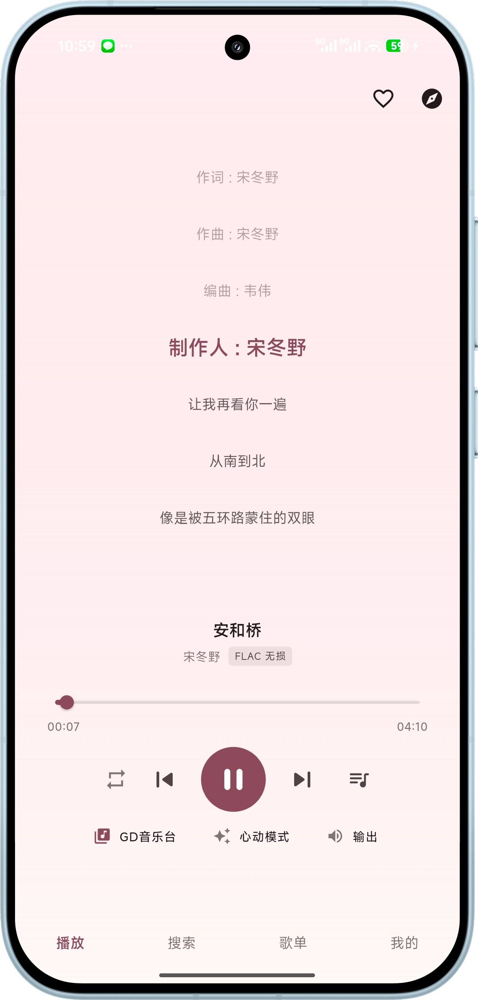
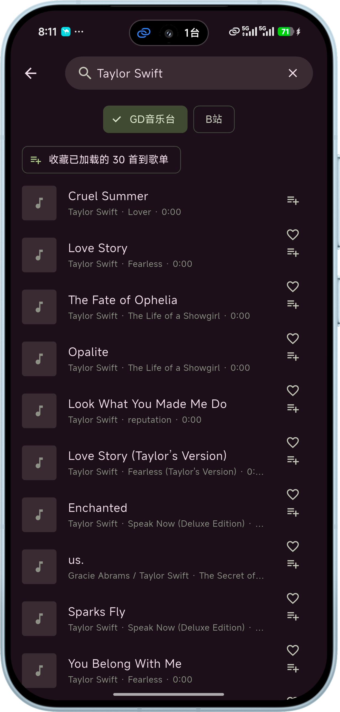
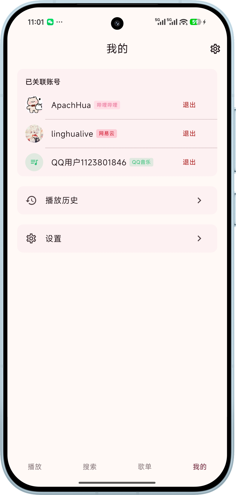

<div align="center">
    
</div>

<div align="center">
    <h1>玲华音乐</h1>


[](LICENSE)

<p>使用 Flutter 开发的多源音乐播放器，支持 Bilibili、网易云音乐、QQ 音乐、GD 音乐台</p>






<br/>
</div>

## 交流频道

QQ 频道：https://pd.qq.com/s/7jeytjyww?b=9

## 功能

适配移动端 (Android) 和桌面端 (macOS、Linux)

- [x] 播放相关
  - [x] 多源播放：B 站、网易云、QQ 音乐、GD 音乐台，可随时切换音乐源
  - [x] 播放队列管理：添加、删除、拖拽排序
  - [x] 多种播放模式：顺序播放、随机播放、单曲循环
  - [x] Mini 播放器和全屏播放器自由切换
  - [x] 播放队列结束后自动推荐新歌曲继续播放
  - [x] 音频输出设备切换（iOS AirPlay、Android 系统输出、桌面端 mpv 设备选择）
  - [x] 播放 B 站歌曲时点击作者名可查看 UP 主合集
  - [x] 心动模式：AI 根据偏好自动推荐

- [x] 搜索相关
  - [x] 多源搜索：B 站、网易云、QQ 音乐、GD 音乐台切换
  - [x] 热搜词和搜索建议
  - [x] 热门歌手快捷入口
  - [x] 搜索历史记录
  - [x] 网易云支持搜歌曲、歌手、专辑、歌单

- [x] 歌词相关
  - [x] 自动匹配在线歌词
  - [x] 逐行滚动歌词显示
  - [x] 找不到歌词时自动尝试其他来源

- [x] 发现音乐
  - [x] 精选歌单推荐（网易云 + QQ 音乐）
  - [x] 风格分类歌单
  - [x] 发现音乐主题分类（经典老歌、ACG、KTV 等）
  - [x] 多源排行榜
  - [x] 每日推荐（需网易云登录）
  - [x] 热门歌手推荐

- [x] 收藏管理
  - [x] 本地歌单创建与管理
  - [x] 一键导入网易云 / QQ 音乐 / B 站收藏夹
  - [x] 浏览歌单时一键收藏到本地
  - [x] 歌单内歌曲一键批量播放

- [x] 智能换源
  - [x] 歌曲无法播放时自动从其他源搜索同名歌曲无缝切换
  - [x] 整个过程自动完成，无需手动操作

- [x] 设置相关
  - [x] 主题模式：亮色 / 暗色 / 跟随系统
  - [x] 动态取色 (Monet)
  - [x] 多种主题色可选
  - [x] B 站扫码登录 / 网易云登录 / QQ 音乐登录
  - [x] 应用内检查更新
  - [x] DeepSeek AI 推荐配置

## 下载

可以通过右侧 Releases 进行下载，或拉取代码到本地编译。

### 从源码构建

```bash
git clone https://github.com/linghualive/linghuaplayer.git
cd linghuaplayer
flutter pub get
flutter run
```

```bash
# Android APK
flutter build apk --release

# macOS 应用
flutter build macos --release
```

## 声明

此项目是个人为了兴趣而开发，仅用于学习和测试。所用 API 皆从官方网站收集，不提供任何破解内容。

- 所有音频、视频内容的版权归原作者和平台方所有，本项目不存储、不分发任何版权内容。
- 使用本项目产生的一切法律责任由使用者自行承担，与项目开发者无关。
- 本项目不收集任何用户数据，所有登录凭证仅存储在用户本地设备上。

**如果本项目侵犯了您的权益，请联系 linghualive@163.com，我们将立即删除相关内容。**

## 赞赏

如果觉得这个项目对你有帮助，欢迎请我喝杯咖啡 :)


## 致谢

- [GD音乐台 (music.gdstudio.xyz)](https://music.gdstudio.xyz) — 提供免费 API
- [media-kit](https://github.com/media-kit/media-kit)
- [just_audio](https://pub.dev/packages/just_audio)
- [dio](https://pub.dev/packages/dio)
- [GetX](https://pub.dev/packages/get)

## 开源协议

本项目基于 [GPL-3.0](LICENSE) 协议开源。
