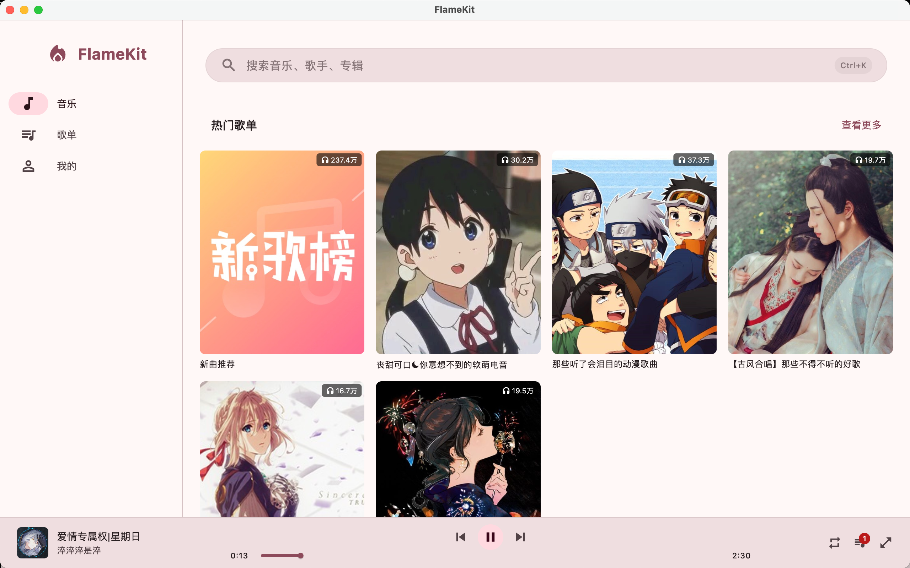
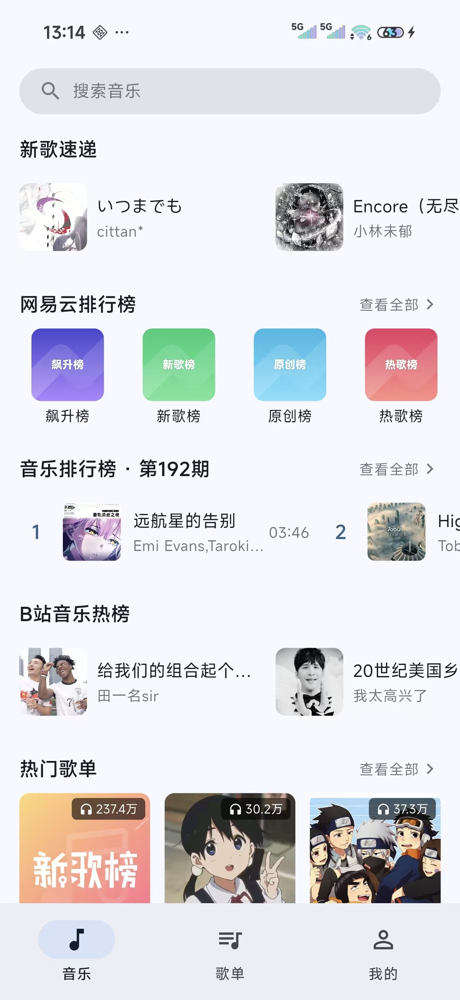

# 玲华音乐

[](https://flutter.dev)
[](https://github.com/user/flamekit)
[](LICENSE)

玲华音乐是一款多源音乐播放器，支持从 Bilibili、网易云音乐和 QQ 音乐搜索、发现和播放音乐，适配手机和电脑。

## 预览

### 桌面端

<div align="center">
  
</div>

### 移动端

<table>
  <tr>
    <td align="center" width="50%">
      
      <br>
      <sub><b>首页</b></sub>
    </td>
    <td align="center" width="50%">
      
      <br>
      <sub><b>收藏</b></sub>
    </td>
  </tr>
</table>

## 已实现的功能

### 播放

- 支持播放 B 站、网易云和 QQ 音乐的音乐，可随时切换音乐源
- 支持视频模式播放，可在音频和视频之间切换
- 播放队列管理：添加、删除、拖拽排序
- 多种播放模式：顺序播放、随机播放、单曲循环
- Mini 播放器和全屏播放器自由切换
- 播放队列结束后自动推荐新歌曲继续播放
- 音频输出设备切换（iOS AirPlay、Android 系统输出、桌面端 mpv 设备选择）
- 播放 B 站歌曲时点击作者名可查看该 UP 主的合集

### 搜索

- 在 B 站、网易云和 QQ 音乐之间切换搜索
- 支持热搜词和搜索建议
- 保留搜索历史，方便回顾

### 歌词

- 自动匹配在线歌词
- 支持逐行滚动歌词显示
- 歌曲找不到歌词时自动尝试其他来源

### 发现音乐

- B 站热门音乐榜单和热门 MV
- 网易云新歌速递和推荐歌单

### 收藏管理

- 查看和管理 B 站收藏夹
- 创建新收藏夹、添加歌曲到收藏
- 收藏夹内歌曲一键批量播放

### 智能换源

- 网易云歌曲无法播放时，自动从 B 站搜索同名歌曲无缝切换
- 整个过程自动完成，无需手动操作

### 其他

- 跟随系统的动态主题配色
- B 站扫码登录
- 可选择不同音质
- 手机和电脑共用一套界面，自适应屏幕大小

## 开发指南

如果你想参与开发或者自己编译运行，可以参考以下步骤。

### 环境准备

- 安装 [Flutter](https://flutter.dev/docs/get-started/install)（3.x 版本）
- 根据目标平台准备对应环境：
  - **Android**: 安装 Android Studio 和 Android SDK
  - **macOS**: 安装 Xcode
  - **Linux**: 安装必要的桌面开发库

### 获取代码并运行

```bash
git clone https://github.com/user/flamekit.git
cd flamekit
flutter pub get
flutter run
```

### 构建安装包

```bash
# Android APK
flutter build apk --release

# macOS 应用
flutter build macos --release
```

### Android 签名配置

在 `android/` 目录下创建 `key.properties` 文件：

```properties
storePassword=your_password
keyPassword=your_password
keyAlias=upload
storeFile=upload-keystore.jks
```

### 项目结构

```
lib/
  main.dart          # 应用入口
  pages/             # 页面
  services/          # 数据和网络服务
  widgets/           # 可复用组件
  models/            # 数据模型
```

### 贡献代码

1. Fork 本仓库
2. 创建你的分支 (`git checkout -b feature/your-feature`)
3. 提交更改 (`git commit -m 'feat: add some feature'`)
4. 推送到分支 (`git push origin feature/your-feature`)
5. 创建 Pull Request

## 问题反馈

遇到 Bug、有功能建议、或者使用中有任何疑问，都欢迎通过 [Issues](../../issues) 提出。

提 Issue 时建议包含：
- 你使用的平台（Android / macOS / Linux）
- 问题的具体表现或复现步骤
- 如果方便，附上截图

你的反馈对项目改进非常重要，感谢参与！

## Buy Me a Coffee

如果觉得这个项目对你有帮助，欢迎请我喝杯咖啡 :)


## 🤝 参与贡献

感谢 [GD音乐台(music.gdstudio.xyz)](https://music.gdstudio.xyz) 提供的免费API

## 免责声明

本项目仅供学习交流和个人使用，**请勿用于任何商业用途**。

- 本项目调用的 Bilibili 和网易云音乐接口**均未经官方授权**，所有接口来源于公开的网络资料，可能随时变更或失效。
- 所有音频、视频内容的版权归原作者和平台方所有，本项目不存储、不分发任何版权内容。
- 使用本项目产生的一切法律责任由使用者自行承担，与项目开发者无关。
- 频繁调用第三方接口可能导致账号被限制或封禁，请合理使用。
- 本项目不收集任何用户数据，所有登录凭证仅存储在用户本地设备上。

**如果本项目侵犯了您的权益，请联系 linghualive@163.com，我们将立即删除相关内容。**

## 开源协议

本项目基于 [GPL-3.0](LICENSE) 协议开源。

这意味着：你可以自由使用、修改和分发本项目的代码，但任何基于本项目的衍生作品，必须同样以 GPL-3.0 协议开源并公开源代码。
