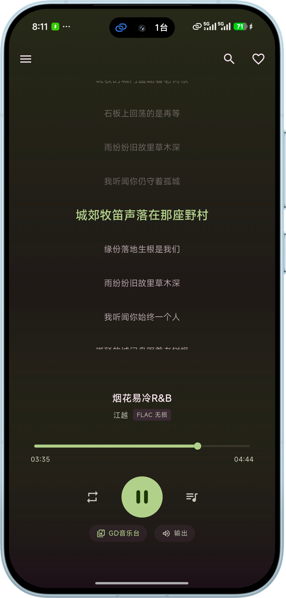
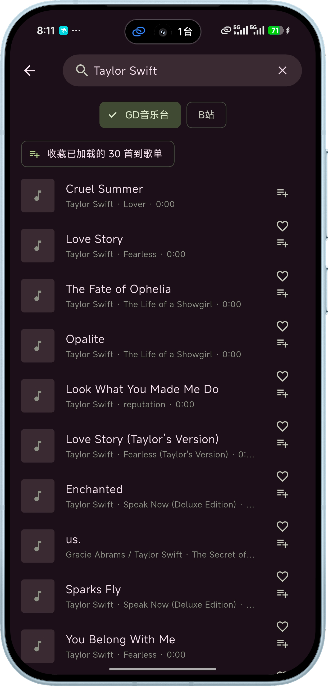
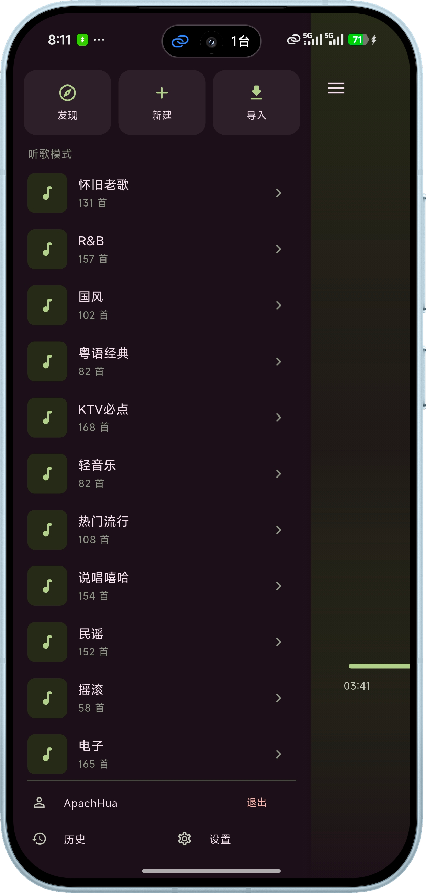
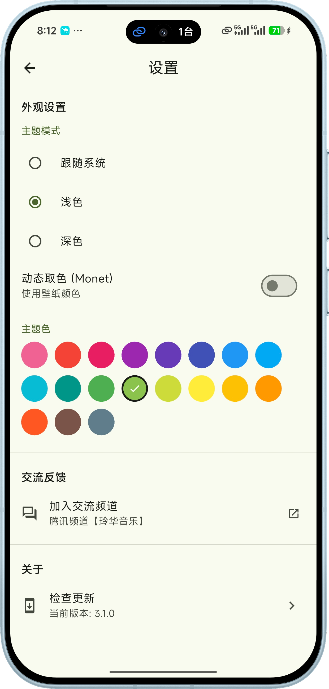
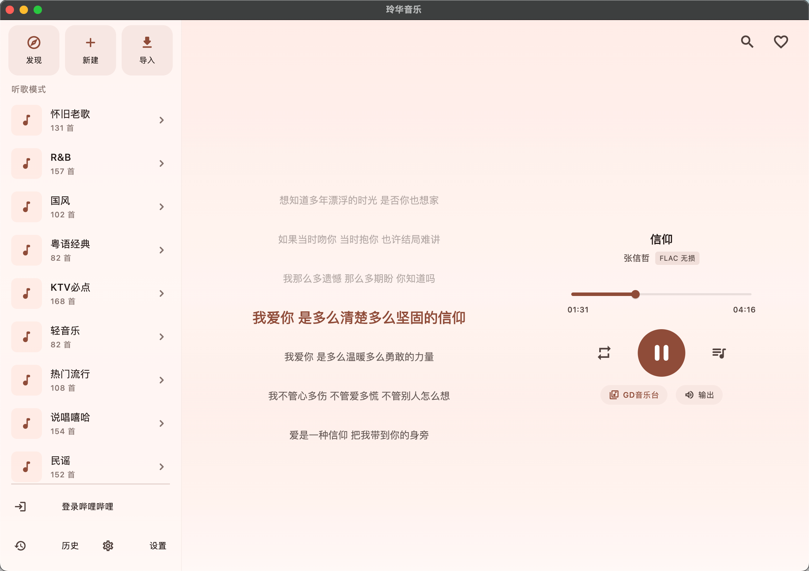

<div align="center">
    
</div>

<div align="center">
    <h1>玲华音乐</h1>
    <p>一款开源的多源聚合音乐播放器</p>


[](LICENSE)

<p>聚合 B 站、网易云、QQ 音乐、GD 音乐台四大音源，一个 App 听遍全网音乐</p>






<br/><br/>

<br/>
</div>

## 特性

- **多源聚合** — 同时接入 B 站、网易云、QQ 音乐、GD 音乐台，搜索和播放时可随时切换音源
- **智能换源** — 当前歌曲无法播放时，自动从其他音源搜索同名歌曲无缝切换，全程无感
- **21 种听歌模式** — 内置怀旧老歌、R&B、国风、粤语经典、KTV 必点等预设模式，每种 100+ 首精选歌曲，打开即听
- **歌词同步** — 自动匹配在线歌词，逐行滚动显示，找不到时自动尝试其他来源
- **一键导入** — 支持从网易云、QQ 音乐、B 站收藏夹一键导入歌单到本地
- **AI 推荐** — 心动模式根据听歌偏好自动推荐，播放队列结束后自动续播
- **跨平台** — 适配 Android 手机和 macOS / Linux 桌面端

## 下载

前往 [Releases](https://github.com/linghualive/linghuaplayer/releases) 下载最新版本。

### 从源码构建

```bash
git clone https://github.com/linghualive/linghuaplayer.git
cd linghuaplayer
flutter pub get
flutter run
```

```bash
# Android APK
flutter build apk --release

# macOS 应用
flutter build macos --release
```

## 功能一览

<details>
<summary><b>播放</b></summary>

- 多源播放，随时切换音乐源
- 播放队列管理：添加、删除、拖拽排序
- 播放模式：顺序 / 随机 / 单曲循环
- Mini 播放器与全屏播放器自由切换
- 播放 B 站歌曲时点击作者名可查看 UP 主合集
- 音频输出设备切换
</details>

<details>
<summary><b>搜索</b></summary>

- 四大音源自由切换搜索
- 热搜词、搜索建议、搜索历史
- 热门歌手快捷入口
- 网易云支持搜歌曲、歌手、专辑、歌单
</details>

<details>
<summary><b>发现</b></summary>

- 精选歌单推荐（网易云 + QQ 音乐）
- 风格分类歌单、主题分类
- 多源排行榜
- 每日推荐（需网易云登录）
- 热门歌手推荐
</details>

<details>
<summary><b>收藏与模式</b></summary>

- 本地歌单创建与管理
- 一键导入网易云 / QQ 音乐 / B 站收藏夹
- 21 种内置听歌模式，自定义创建
- 滑动抽屉快速切换模式
</details>

<details>
<summary><b>个性化</b></summary>

- 主题模式：亮色 / 暗色 / 跟随系统
- 动态取色（Material You）
- 多种主题色可选
- B 站扫码登录 / 网易云登录 / QQ 音乐登录
- 应用内检查更新
- DeepSeek AI 推荐配置
</details>

## 交流

QQ 频道：https://pd.qq.com/s/7jeytjyww?b=9

## 声明

本项目仅用于学习和技术交流，所用 API 均来自官方公开接口。

- 所有音视频内容版权归原作者和平台方所有，本项目不存储、不分发任何版权内容
- 使用本项目产生的一切法律责任由使用者自行承担
- 本项目不收集任何用户数据，登录凭证仅存储在本地设备

**如有侵权请联系 linghualive@163.com，将立即处理。**

## 赞赏

如果觉得项目对你有帮助，欢迎请我喝杯咖啡 :)


## 致谢

- [GD 音乐台](https://music.gdstudio.xyz)
- [media-kit](https://github.com/media-kit/media-kit)
- [just_audio](https://pub.dev/packages/just_audio)
- [dio](https://pub.dev/packages/dio)
- [GetX](https://pub.dev/packages/get)

## 开源协议

[GPL-3.0](LICENSE)
